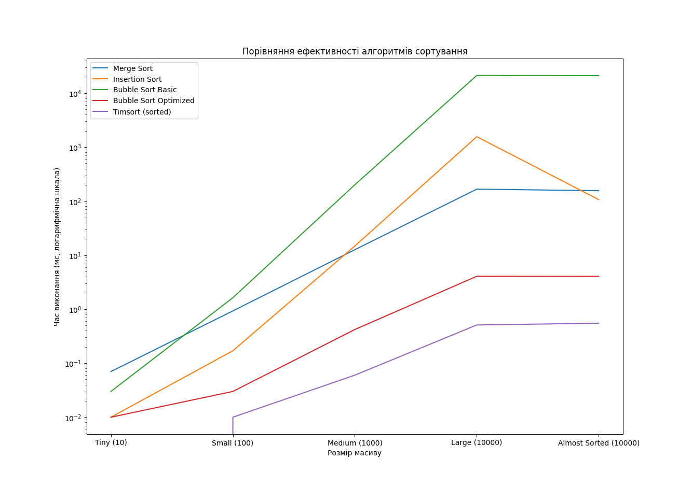

## Висновки щодо оцінки складності алгоритмів сортування

### 1. Вступ

У сучасному програмуванні алгоритми сортування грають важливу роль у обробці та організації даних. Залежно від контексту, вибір алгоритму може суттєво вплинути на продуктивність програми. У цьому дослідженні я провела експерименти, щоб порівняти різні алгоритми сортування, зокрема:

- Сортування злиттям (Merge Sort)
- Сортування вставками (Insertion Sort)
- Сортування бульбашкою (Bubble Sort Basic та Optimized)
- Timsort (вбудований алгоритм Python)

### 2. Теоретичні оцінки складності алгоритмів

Результати експериментального тестування підтверджують теоретичні оцінки складності різних алгоритмів сортування:

| Алгоритм                  | Tiny (10) | Small (100) | Medium (1000) | Large (10000) | Almost Sorted (10000) |
| ------------------------- | --------- | ----------- | ------------- | ------------- | --------------------- |
| **Merge Sort**            | 0.07 мс   | 0.93 мс     | 12.62 мс      | 166.97 мс     | 156.23 мс             |
| **Insertion Sort**        | 0.01 мс   | 0.17 мс     | 14.78 мс      | 1562.17 мс    | 106.83 мс             |
| **Bubble Sort Basic**     | 0.03 мс   | 1.63 мс     | 200.98 мс     | 21251.64 мс   | 21125.58 мс           |
| **Bubble Sort Optimized** | 0.01 мс   | 0.03 мс     | 0.42 мс       | 4.07 мс       | 4.05 мс               |
| **Timsort**               | 0.0 мс    | 0.01 мс     | 0.06 мс       | 0.51 мс       | 0.55 мс               |

### 3. Ефективність алгоритмів

- **Сортування злиттям (Merge Sort)** має час виконання O(n log n) у найгіршому випадку, що видно з результатів, де час для великого масиву (10,000 елементів) становить приблизно 166.97 мс. Цей алгоритм показує стабільні результати навіть для великих масивів.

- **Сортування вставками (Insertion Sort)** має час виконання O(n^2), що відображається в його значних затримках на великих масивах. Наприклад, час виконання для великого масиву становить 1562.17 мс, що свідчить про високу неефективність цього алгоритму при обробці великих даних.

- **Сортування бульбашкою (Bubble Sort Basic)** також демонструє O(n^2) в найгіршому випадку, що підтверджується величезним часом виконання — 21251.64 мс для великого масиву.

- **Оптимізоване сортування бульбашкою** показує поліпшення, але все ще залишається неефективним, з часом виконання близько 4.07 мс для великого масиву, в порівнянні з іншими алгоритмами.

- **Timsort** (вбудований алгоритм Python) демонструє чудову ефективність з часом виконання 0.51 мс для великого масиву. Його оцінка складності O(n log n) у найгіршому випадку свідчить про його потужність, зокрема у випадках, коли масив вже частково впорядкований.

### 4. Ефективність Timsort

Результати експериментів показують, що Timsort, поєднуючи сортування злиттям і сортування вставками, є набагато ефективнішим, ніж інші прості алгоритми:

- **Сортування злиттям** надає Timsort його основну структуру, забезпечуючи ефективне оброблення великих наборів даних.

- **Сортування вставками** оптимізує обробку невеликих підмасивів, що часто зустрічаються в реальних даних. Це поєднання дозволяє Timsort адаптуватися до різних ситуацій, зберігаючи високу продуктивність у випадках часткового впорядкування.

### 5. Вибір алгоритмів у програмуванні

Дані експериментів свідчать про те, що програмісти, в більшості випадків, використовують вбудовані алгоритми, такі як Timsort у Python, замість написання власних реалізацій:

- **Ефективність**: Timsort показує значно кращу продуктивність у порівнянні з простими алгоритмами, особливо на великих масивах, де затримка для оптимізованого алгоритму була в десятки тисяч мілісекунд для Bubble Sort.

- **Простота використання**: Вбудовані алгоритми дозволяють програмістам зосередитися на інших аспектах розробки, не витрачаючи час на оптимізацію алгоритмів сортування.

- **Універсальність**: Timsort працює добре в більшості сценаріїв, забезпечуючи стабільність та швидкість, що робить його ідеальним вибором для різних застосувань.

### 6. Висновок

Отже, результати експерименту підтверджують, що Timsort є набагато більш ефективним алгоритмом сортування в порівнянні з базовими алгоритмами, і його використання в Python є обґрунтованим вибором для програмістів, які прагнуть досягти оптимальної продуктивності в своїх проєктах.
